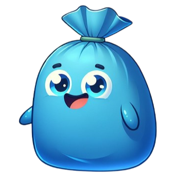
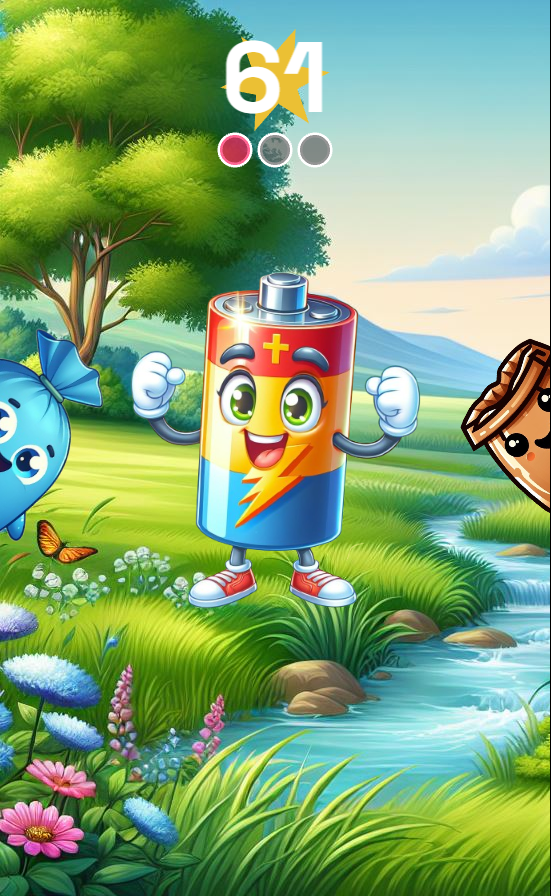
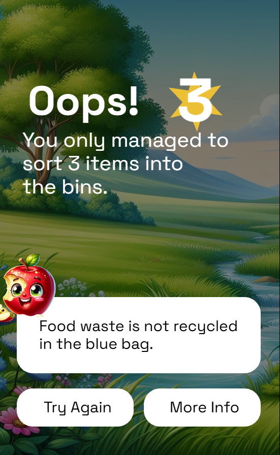

  

 

  <b>zer0match</b> is an entry for the Hack the Waste 2025 hackathon.  
  A simplified recycle sorting game. 

> [!NOTE]
> This project makes extensive use of AI generated assets due to obvious time constraints. In any production context, these assets would be custom-made to fit a consistent style and quality.

  
  

Swipe left or right to determine whether an item belongs in PMC. Earn points and learn!

# Team

The hackathon team includes myself, Morgan, P. D. and [Muhle](https://github.com/Ashley-sdev)
